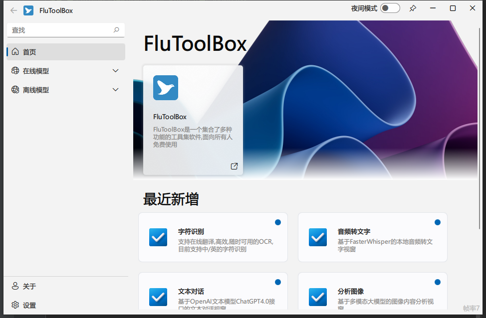
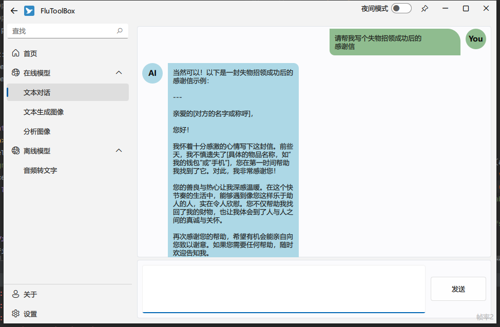
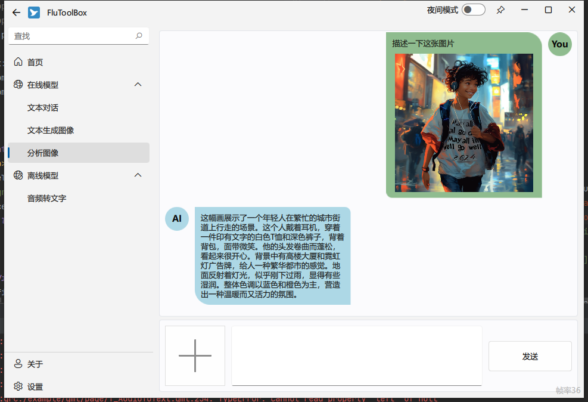
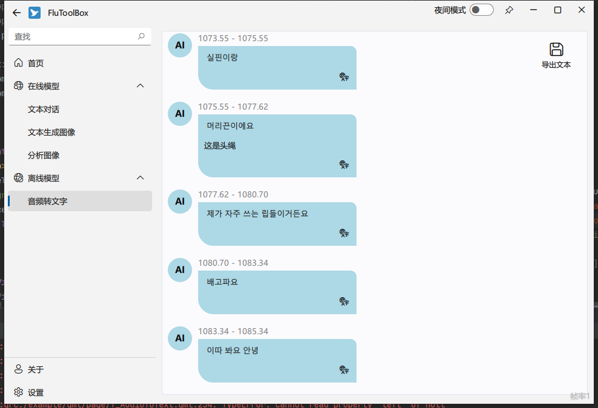

<h1 align="center">
  FluToolBox 
</h1>
<div align=center>
  
</div>
<p align="center">
基于Pyside6-Qml打造的开箱即用多功能工具箱,暂不存在开源计划,如需使用请移步Releases下载使用
</p>
<p align="center">
(PS:对于在线模型部分,额度用完后看心情更新或自行使用你自己api key)
</p>

<p align="center">
<a ></a>
</p>

[win-badge]: https://github.com/zhuzichu520/FluentUI/workflows/Windows/badge.svg  "Windows"

[ubuntu-link]: https://github.com/zhuzichu520/FluentUI/actions?query=workflow%3AUbuntu "UbuntuAction"

[ubuntu-badge]: https://github.com/zhuzichu520/FluentUI/workflows/Ubuntu/badge.svg "Ubuntu"

[macos-link]: https://github.com/zhuzichu520/FluentUI/actions?query=workflow%3AMacOS "MacOSAction"

[macos-badge]: https://github.com/zhuzichu520/FluentUI/workflows/MacOS/badge.svg "MacOS"

## Requirements

```
注意:由于qt6不在支持win7以下版本,win7以下用户请酌情下载
```

## Get started
+ 进入[Releases](https://github.com/RichaoWang/FluToolBox/releases)下,根据版本下载最新的FluToolBox,双击exe即可使用.
```
对于离线模型部分,权重文件较大,故不好一并打包,如果你有用到该部分的功能,请根据页面指引下载对应权重文件,并放置于exe文件同级目录下
```

## Screen shots

* 首页
    * 

* 文本对话
    * 

* 分析图像
    * 

* 音频转文字
    * 

## Reference

+ [**FluentUI for qml**: C++ and QML.](https://github.com/zhuzichu520/FluentUI)

